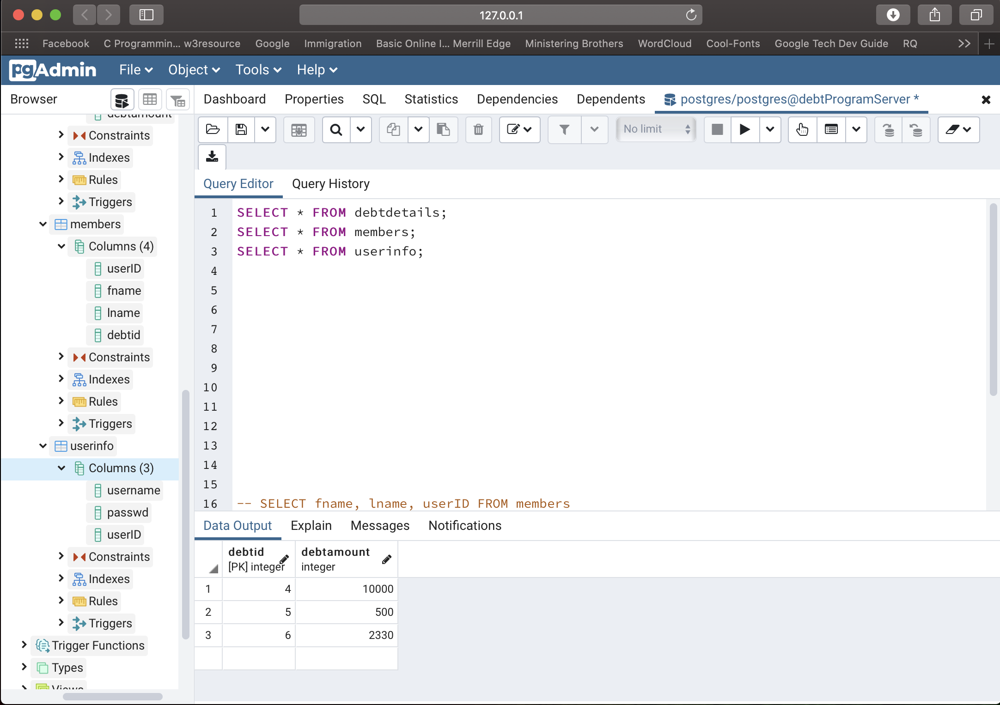
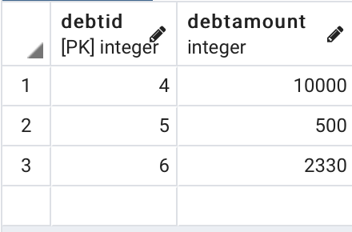
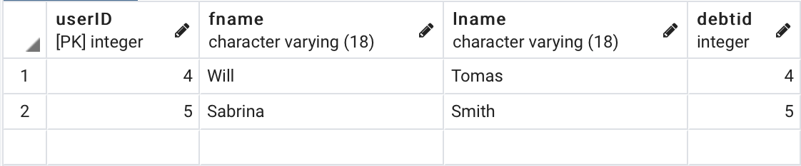
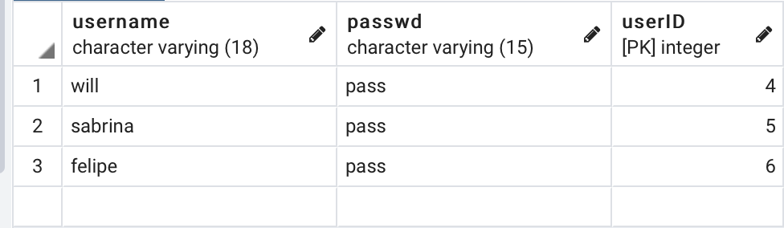

# Debt Console Application - C++

This is a basic console application that will allow to keep track of payments users makes 
to an entity. 
 IE: There is an outstanding balance of $5000. A user makes payments to this entity and lowers the balance.
    The program will keep track of this user adding all the payments
    but also making sure the debt amount is upgraded 
 The program allows for a manager to make changes to payments, delete users and much more. A normal user
    can only make payments, view and exit the program. 

Time spent: **15** hours spent in total

## User Stories

The following **required** functionality is completed:

- [x] User can create new account
- [x] The program will read in users from a database and their corresponding payments
- [x] Manager can remove a member from the program
- [x] The program will save members and their corresponding payments into a database  
- [x] The program calculates total amount paid from all users 
- [x] User can validate all the money left to pay 
- [x] Manager can upgrade a members account 
- [x] Managers have different view options 
- [x] Login capabilities 

## Table Implementation - Draft 

### Users Table
 | userID~ | username | password | fname | lname | ismanager | 
 | ------- | -------- | -------- | ----- | ----- | --------- |

### Payments Table 
 | username~ | payment_amount | payment_date | paymentID| 
 | --------- | -------------- | ------------ | -------- |

### Debt Details Table 
 | username~ | debtamount | 
 | --------- | ---------- |

The logic here ^ is that a Users  has an outstanding debt [IE: $1000] and they make 
payments to that debt. The payments are recorded in the Payments table with a datestamp and also an identifier
as proof of completed submission. The Debt table has the final debt the user owes but the program will update it
before quitting to make sure everything is saved accordingly.

~ Represents PK 

### Screenshots of DB

## Dependencies/Libraries 
- Libpqxx, the C++ API to the PostgreSQL database management system. <a href="http://pqxx.org" >Learn more</a>
- Termcolor is a header-only C++ library for printing colored messages to the terminal. <a href="https://github.com/ikalnytskyi/termcolor" >Learn more</a>
- Local instance of PostgresSQL up & running; Use this connection string `host=127.0.0.1 port=5432 dbname=postgres user=postgres password=password`

## Instructions to run the program
- Navigate to file location
- Compile the program using : $ g++ -std=c++17 'nameOfFile.cpp'  -lpqxx -lpq -o './nameOfEXE'
- Run the program by executing ./nameOfEXE 

## Video Walkthrough

Here's a walkthrough of implemented user stories:

## Completed Video Walkthrough 

